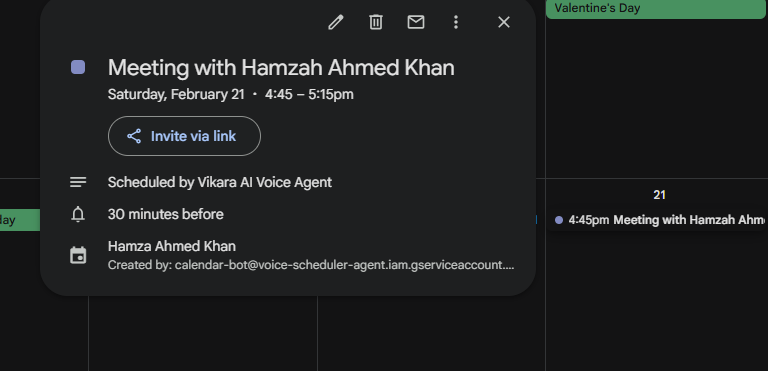

# Vikara AI: Voice-Driven Appointment Scheduler 🎤📅

**Vikara AI** is an intelligent voice assistant designed to bridge the gap between natural human conversation and structured digital scheduling. By leveraging Large Language Models (LLMs) and real-time audio streaming, this agent can autonomously understand user intent and manage a Google Calendar.

---

## 🏗️ Technical Architecture

The system is built on a **Three-Tier Architecture**:

1.  **Client Interface (The Ears & Mouth):**
    * **Vapi Web SDK:** Handles low-latency audio capture and playback.
    * **Live Transcripts:** A real-time UI component that provides visual feedback to the user, enhancing accessibility and trust.
    
2.  **Orchestration Layer (The Brain):**
    * **Model:** GPT-4o via Vapi.ai.
    * **Prompt Engineering:** The agent is instructed to act as a professional scheduler, maintaining state across the conversation to ensure all variables (`name`, `date`, `time`) are captured before execution.
    * **Function Calling:** Dynamically generates JSON payloads to trigger the backend fulfillment.

3.  **Fulfillment Layer (The Hands):**
    * **Node.js/Express:** A secure middleware that validates requests and formats data for the Google API.
    * **Google Calendar API v3:** Programmatically inserts events using a Service Account for server-to-server authentication.
    * **Ngrok:** Provides a secure tunnel to expose the local server to the Vapi cloud.

---

## 📸 Proof of Work (Screenshots)

Since the backend fulfillment requires my local server to be active via Ngrok, I have documented the successful integration below. All demonstration images are located in the `TASK-01-Vikara-AI` directory.

| **Voice Transcript & Intent** | **Google Calendar Event** |
| :--- | :--- |
|  |  |
| *Riley extracting name and time.* | *The resulting event in Google Calendar.* |

### 🖥️ Backend Execution Logs

*Terminal logs confirming the successful 200 OK response from the Google Calendar API.*

---

## 🛡️ Security & DevOps

* **Credential Protection:** Successfully implemented **GitHub Push Protection** and `.gitignore` strategies to ensure `credentials.json` and `.env` files are never exposed in the public history.
* **Environment Isolation:** Uses `dotenv` to separate configuration from code, allowing for easy deployment across different environments.
* **Git Workflow:** Maintained a clean, multi-branch Git strategy (`main` and `development`) to manage features and production-ready code.

---

## 🚀 Setup & Deployment

### 1. Repository Installation
```bash
git clone [https://github.com/HamzaAhmedKhan786/voice-scheduling-agent.git](https://github.com/HamzaAhmedKhan786/voice-scheduling-agent.git)
cd voice-scheduling-agent/backend
npm install